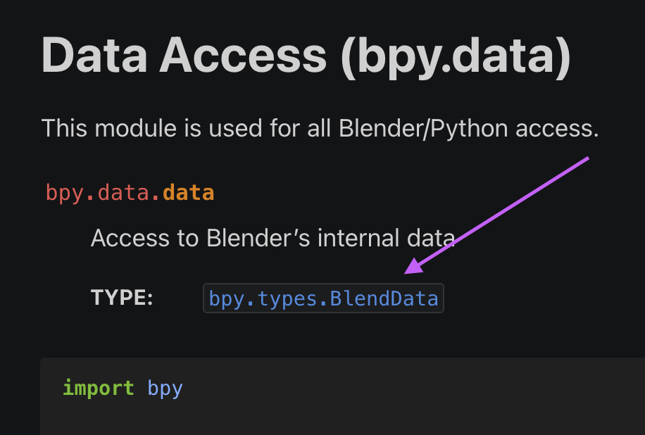
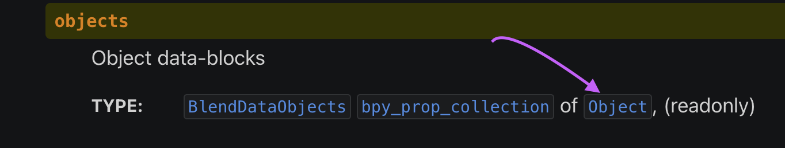
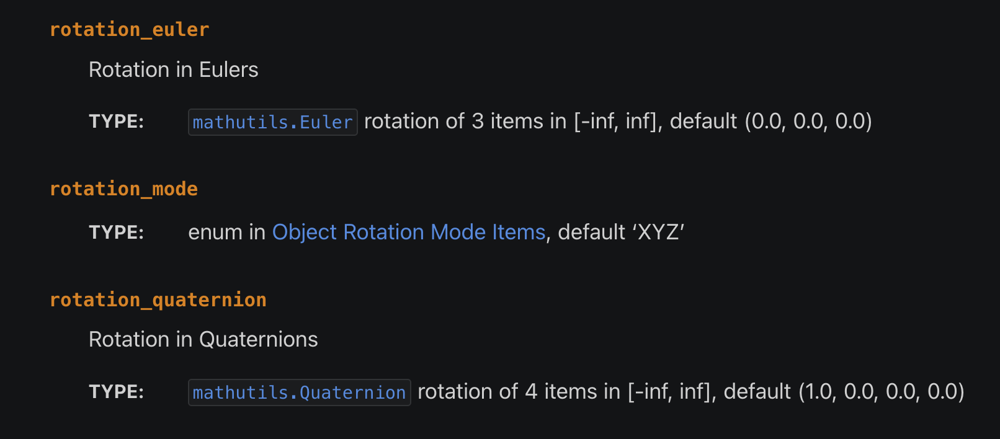

Words we have to agree on:

### Data

for computers, everything is a bunch of numbers. That’s all a computer “understands”.

This text is written on a computer so it’s just a series of numbers.
Your music is also just a series of numbers that represents frequencies to be reproduced by your speakers.
An image is a series of pixels that each represent a color which itself is just a number.

The point is, if a computer can do anything with it, then it should be made of numbers.

You might think that since it’s all numbers then one should be good with math to be good at coding. I assure you this is not the case. It’s really helpful to be good at math but most professional programmers suck at math so don’t worry. Math is not an issue for 90% of what you need to do and for the 10% there are always solutions on the internet. Math has been around much longer than computers and almost every math puzzle you meet along the way is solved a few centuries ago!

### Code
code is a recipe that gets the data and changes it into some other data. Like a food recipe it’s a set of steps that should be done in a well defined order to achieve a goal.

For example an instagram filter is a piece of code that takes a picture as input data and applies some math trick like averaging colors to reduce the image details and make it look more smooth (which happens to make us think people have better skin than they really do!)

### Objects

Since computers only understand numbers, we have to reduce everything we want to represent in a computer with numbers. Lets see an example. 

How would you represent a square with numbers ? If you think about it you just need a single number since all the edges in a rectangle have the same length


What about a rectangle ? well you need two numbers, one for width and the other for hight:


In this case we would define this rectangle as so in Python

 `Rectangle(width=10, height=5)` 

This reads as `Rectangle` with a width of `10` and a height of `5`. 

We don't care about the details of Python for the moment. All we care about right now is that looking at that line you can already have an idea of what that means! not that hard is it ? (Unlike French)

Lets try something slightly more complex. What about a person ? How do you model a person as a bunch of numbers ? (Objectify much?) well the answer depends of what you want to do with that object. If you want to build an accounting software you might define them with this properties.

* A name which is a bunch of text (which is a bunch of numbers itself)
* A social security number
* An employee number
* and a bunch more boring stuff

We don't want to make an accounting software though so let's say the person we want to model is an NPC in a video game. 

* We still probably need a name let's call this one `Merchant Alice`
* We might need some state like `Walking` 
* We might want them to have an `intelligence = 10`
* and so on

The point is we define this objects to be whatever is useful for our purpose. 

### Libraries

We need to understand one last concept to get started. A library is a bunch of code and objects someone else has created that you can use in your own projects. The most used one when working with blender is a library (or lib, or package) called `bpy`. This package has everything you need to make blender do your bidding! 

## Project N1

For our first project, let's create a tool that resets an object in blender. By reset we mean:

1. move it's location to (x=0, y = 0, z = 0)
2. set it's rotation to (x=0, y = 0, z = 0)
3. set it's scale to (x=1, y = 1, z = 1)

We also want to integrate our tool in Blender so that we could use it in our daily work. 

You might ask when we would need such a tool. I don't know we have to start with a simple task and build from there so this is our first step!

### Step 1 - Open the project file

from the folder `assets/blender` open the file `project_1.blend` in blender. This is the empty blender project that you have seen many times already.

1. from the top menu click `scripting` and you should see the scripting window.
2. Click `New` and now you have a new script which is a file that you can write you code in.
3. Inside the scripting window click the `Text` menu and then `Save` choose the name `reset.py` and save the file

type `import bpy` and press enter. You will see that the `import` part becomes red. This means that is a keyword in Python. Keywords are words with special meaning in a programming language. Here you are saying to Python. I want to use a package (or library remember?) called bpy which is the blender package. without this line Python has no idea how to talk with Blender.

now type this

`# This is my first Blender script !!!`

note that this line is gray. This is what we call a comment. It starts with a `#` and it tells python that what every is written on that line is not code but just a bunch of text that we have written as a note to ourselves or another poor soul that has to figure out our code. Good programmers comment their code to explain what the hell they are doing so that when they come back to the code they have an easier time reading it.

next let's add this line, things are getting serious here

`my_cube = bpy.data.objects['Cube']`

this is called an assignment. it has 3 parts.
1. the left hand side 
2. `=`
3. the right hand side

lets start at the right. `bpy.data.objects['Cube']`. the first part is `bpy` which means we are working with `bpy` library. the dot that comes after means we are working with something inside `bpy` in this case that is an object called `data` and inside that we are working with an object called `objects`. 

In other words `A.B.C` means I need `C` which is located inside `B` which is located inside `A`. If for example Google's addresses was written in Python syntax it would look something like  `US.CA.MOUNTAIN_VIEW.AMPHITHEATRE PARKWAY.1600`. 

So what the hell is `bpy.data.objects` you ask ? this is an object that has a list of all objects that are inside Blender. Every time you create a new object it gets added to this one and later we can access it to do what ever we want with it. 

what about this part you ask `['Cube']`. This again can be split to two parts. first the brackets `[]` which means I want you to get me an object inside you with a specific name and you have guessed it. `'Cube'` is the name of the object we want to get. 

But you would say, wait the name of the object is not `'Cube'`, it's `Cube` and you are right but the name of the object is what we call a string and in Python you have to put strings inside `''` or `""` otherwise Python gets very confused and gives you errors.

now that we have learned what the code to the right does let's see what `=` does. This is much easier. `=` is the assignment operator which tells Python, put what ever is to my right into whatever is in the left.

and in the left we have what we call a variable. a variable is nothing but a new we have given to an object for us to remember what is inside it.

so finally we can say the code `my_cube = bpy.data.objects['Cube']` tells Python to find an object named `Cube` and put it in a variable called `my_cube`.

Now run your code by pressing the play button on the top of the scripting window. Nothing happens yet because we read the object but we don't do anything with it. So lets add some more code. 

add this line 

```python
my_cube.location = (0, 0, 0)
```

so now you should have this code

```python
import bpy

# This is my first Blender script !!!

my_cube = bpy.data.objects['Cube']
my_cube.location = (0, 0, 0)
```

This is obviously another `assignment` that says put `(0,0,0)` into `location` property of our object which is in `my_cube` variable. The value `(0,0,0)` has 3 numbers for x,y and z which are all zeros. running this code updates the location of the object to (0,0,0). lets use blender UI to move the object a bit and see if running our code will bring it back!

Hurray! we finally did something but what is the point? You could have done that with the UI far more easily. The point is that we can make our code do more and more complex things which are almost always possible to do with the UI but we could do that way faster with code. Let's make our code even more advanced to see what I mean. Also there are things that are impossible to do with the UI but easy to do with code.

lets now add one more line to our code.

```python
my_cube.scale = (1, 1, 1)
```

here we set the scale of the object to (1,1,1) which is the initial scale of the object in 3 dimensions (x, y, z). Again use the UI to change the scale and run the script to reset it back to original. 

Now let's do the same with rotation. here is the code

```python
my_cube.rotation_euler = (0, 0, 0)
```

note that the property we change is not called `rotation` but `rotation_euler`. If you look at the UI you will see that we have a `Mode` for rotation and we can set rotation in different ways (or modes). The default mode is euler and the corresponding property is called `rotation_euler`. Test to see that your code works.

Now let's use the UI and change the rotation mode to Quaternion and rotate the object in this mode. Then run the code and see what happens. 

You will see that the rotation does not change. This is because the object is in another rotation mode and we are setting the euler rotation. How we can fix this issue ? We need to read the documentation to learn how to fix the issue. The documentation is your first place when figuring out how to interact with blender API (bunch of code that does the job).

got to https://docs.blender.org/ and click on Python api. On the left sidebar inside 'APPLICATION MODULES' click on Data Access (bpy.data) which is the API we are using to access the object. 

On this page you will see the documentation for `bpy.data`



You see the TYPE on this page in Blue. The type is the code that describes an object so click on the type `bpy.types.BlendData` and open the details page. Inside here you will see a bar on the right. we are interested in `BlendData.objects` so find it and click on `objects`



you should end up on [this page](https://docs.blender.org/api/current/bpy.types.Object.html#bpy.types.Object)

here we can find every details of the `objects` object. I agree it has a confusing name. lets search for rotation and see what we find. 



here we see besides `rotation_euler` that we have seen before, we have `rotation_quaternion` and `rotation_mode`. We also see that the default value for `rotation_mode` is `'xyz'` (notice the quote marks. this is a string) and the default for `rotation_quaternion` to be `(1.0, 0.0, 0.0, 0.0)`

let's add these to our code to get. Now run the code and see that all is reset to it's default value. 

Now let's see how to find and fix issues with our code (or bugs) if you don't know why computer issues are called bug you owe yourself a search on the internet. It's funny story. 

Let's assume the object we want to change is not named `Cube` go to the UI and rename your object to `MyCube` or whatever you feel like it. Then run the code and see what happens. 

You should get something like this in the script output.

```
Python: Traceback (most recent call last):
  File "PATH TO YOUR CODE", line 5, in <module>
KeyError: 'bpy_prop_collection[key]: key "Cube" not found'
```

the part we care about is: `KeyError: 'bpy_prop_collection[key]: key "Cube" not found'` make sure to always read the error messages completely. It helps a lot in fixing the issues in your code. here the error is telling us that no object is found with the key `"Cube"` the `Cube` is inside double quotes because it's a string and we see key instead of the name but let's ignore that detail for the moment. I premiss we get back to it later. 

To fix the issue either change the name in the UI or in the code to make sure you have the same name in both places and verify that the code runs correctly by pressing the play button and seeing no error in the output window.

A note about letter cases. For a computer the lowercase alphabets and the uppercase ones have nothing to do with each other. `Cube` and `cube` are two different names and a computer does not care that in most languages the are almost the same. For computers they are not and if you ignore this you could will fail with error. The same applies to the name of objects or variables.

Now our code works fine but it's not very useful because it requires the object to be named `Cube` or it will not work. To make our script more useful we need to change it to work on the currently selected object instead of an object with a predefined name but how do we achieve that ? 

Again the answer is in the documentation. Let's go back and try to find it. On the [Object page](https://docs.blender.org/api/current/bpy.types.Object.html#bpy.types.Object) search for the keyword `selected` and you will find `bpy.context.selected_objects`. Note that this is not in the `bpy.data` but instead in another object called `bpy.context`. The name of the object is `context` but since it's in the `bpy` package we use it's full name to refer to it in code.

The context object contains not all the data blender has (that would be `bpy.data`) but instead the data that the use is actively working on. This is just how the blender developers decided to slice and dice their data. 

Of course in blender we can select multiple objects at the same time so we have `bpy.context.selected_objects` in plural. When we have to bundle multiple objects together we use a special object called a `list`. Here is a list of numbers assigned to a variable called `my_fav_numbers`

```python
my_fav_numbers = [2, 7, 9]
```
again we have the name of the variable that we pick as we like, then the assignment operator and on the right you get `[]` that indicates we have a list. Inside the brackets we put our numbers or objects and we have to separate them by `,`. So my list have 3 numbers in it.

the items inside a list can be accessed by their index number but we start from 0 because programers think it's cooler to count from 0 instead of 1. so in the case of the list `my_list = [1,3,5]` the first item has the index zero and is used like `my_list[0]` and it's value would be 1, the next item is `my_list[1]` with the value 3 and so on. 

what does this code do then ? 

```
selected_object = bpy.context.selected_objects[0]
```

You are right, we are getting the first item from the list of selected objects

in our code lets replace the line 

`my_cube = bpy.data.objects["Cube"]` with `selected_object = bpy.context.selected_objects[0]`
we also need to replace `my_cube` everywhere with `selected_object` to get this code.

```python
import bpy

# This is my first Blender script !!!

selected_object = bpy.context.selected_objects[0]

selected_object.location = (0, 0, 0)
selected_object.scale = (1, 1, 1)
selected_object.rotation_euler = (0, 0, 0)
selected_object.rotation_quaternion = (1, 0, 0, 0)
selected_object.rotation_mode = "XYZ"
```

Now our code does exactly the same but it does not care what the object is called. It does it's magic to what ever object is selected!

Congratulations! You have finished the first lesson. You should now have an idea of how to write code in Blender and use it to manipulate some properties on blender objects. This is a huge step. See you in the next lesson.


