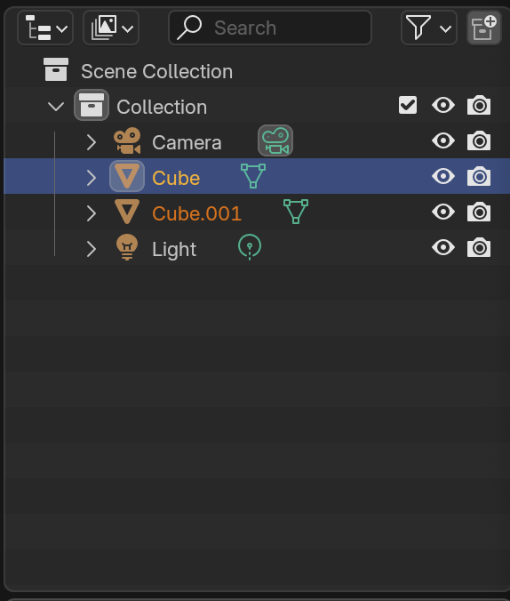

# Lesson 2 

In the previous lesson we learned how to change Objects but that is not very useful in itself. we could have achieved the same result using Blender graphical interface even faster.

The real value of coding is automation. Doing the same thing over and over again instead of doing it manually. Here we introduce the concept of Loops. Loops let us do the same thing many times. Lets see and example.

### Step 1 - Open the project file

from the folder `assets/blender` open the file `project_2.blend` in blender. This is the empty blender project that you have seen many times already.

1. from the top menu click `scripting` and you should see the scripting window.
2. Click `New` and now you have a new script which is a file that you can write you code in.
3. Inside the scripting window click the `Text` menu and then `Save` choose the name `clone.py` and save the file

inside you have to paste this code, you can put as much whitespace between the lines. Python does not care.

```python
# import the blender library to get access to blender objects and code
import bpy

# put the currently selected object in a variable
object_to_clone = bpy.context.selected_objects[0]
```

for this project we want to create a piece of code (or script) that helps are make multiple copies of the selected object. We have found the selected object by telling python to look inside `bpy` package in the `context` object. get the `selected_objects` list and give us `[0]` or the first object in the list. the left hand side `selected_object =` tells python to name that object `object_to_clone` 


## Copy the object

Now how can I create a clone of an object ? 

```python
new_object = object_to_clone.copy()
```

let's break it down. we start by `object_to_clone` which is the name of the object we want to clone (or copy) then comes a `.` that means we want to use something (here a piece of code) that is attached to the object. Then comes the name of the piece of code (or method) that we want to execute (or call) which is `copy` in this case. The empty parenthesis means what comes before (`copy`) is a piece of code. if you omit it Python gets confused. 

On the left side we just put whatever the result of the code is into a new variable named `new_object`.


once we created a copy of the object, we need to put it inside the scene so we have to add a second line of code.

```python
new_object = object_to_clone.copy()
bpy.context.collection.objects.link(new_object)
```

we call (or execute) the method (or piece of code) named `link` on the object `bpy.context.collection.objects` (an object named `objects` inside another named `collection` inside `context` object which itself is inside `bpy` package). Remember that we don't have to keep these names in our memory all the time. This is impossible. Coder often have to search online to remember what was the name of an object or method. Internet is your friend!

with this lines we should be able to clone the object we have selected. Type these lines in blender scripting window. Don't copy paste. Typing this makes sure you are actively learning. 

Once you have the code, select the cube and run the code by clicking the play icon to see what happens. 


> Do not forget to select your object, if you do you will get an error because there would be no first object in the `selected_objects` list. The error will be a bit cryptic like `list index out of range` since python does not understand what you are trying to do.

It looks like nothing has happened but in the scene collection you should see a `Cube.001`



The issue is that the two objects are exactly in the same place so let's fix that. remove the `Cube.001` using Blender UI and add this line to the end of your script.


```python
new_object.location.x = new_object.location.x + 3
```

here we take `new_object.location.x`, add 3 to it and put it back in `new_object.location.x` which is the same as moving the object on the `x` access by 3 units. Now if you run you code you can see the newly created object.

## Automation

Now let's take this to next level. Lets create 10 or 100 different objects!

we can repeat a piece of code using loops. The most used loop in Python is a `for` loop. you can give it a `list` of anything an it will run some code for every single element on the list.

let's now clone all selected objects instead of the single one.

To use for we need to write it like this. First comes the keyword `for` then  we should pick a name for a variable that we use later. let's call it `obj` short for object for now. Then we have to write the keyword `in` and lastly we have to give the name of the list we want to *iterate*. We have to finish the line with a `:`. This is the grammar of the language and should always be respected or you get an error.

```python
for obj in my_list:
```

in our case the list we want to iterate is `bpy.context.selected_objects` so the code becomes

```python
for obj in bpy.context.selected_objects:
```

finally we have to put the code we want to run for each `obj` inside the `for` loop. This part is tricky because Python uses tab to represent nesting. It means that the body of the loop or the code that the loop runs each time should start with a tab. Let's copy paste the clone code inside for.

```python
for obj in bpy.context.selected_objects:
    new_object = obj.copy()
    bpy.context.collection.objects.link(new_object)
    new_object.location.x = new_object.location.x + 3
```

* First note that the `for` line ends with a `:` meaning it has a body.
* Then note that every line has started with whitespace (4 spaces or 1 tab)
* we have replaced `object_to_clone.copy()` with `obj.copy()`

To run this code, Python get's every item in the list one by one. Put's it in variable `obj` and runs the body of the loop (the following 3 lines that are nested inside for)

the final code looks like this.

```python
# import the blender library to get access to blender objects and code
import bpy

# put the currently selected object in a variable
object_to_clone = bpy.context.selected_objects[0]


for obj in bpy.context.selected_objects:
    new_object = obj.copy()
    bpy.context.collection.objects.link(new_object)
    new_object.location.x = new_object.location.x + 3
```

> we are not using `object_to_clone` anymore so you can just remove it.

Let's select the cube and clone it to get 2 cubes. Then select the two and run the code to get 4 cubes. and so on. You will see fewer cubes than you expect because some cubes will overlap but in the UI you can see that the objects double each time.

An interesting side effect of the new code is that if you have not selected any object at all. This code does not give any error because a loop for an empty list is still valid code that does run 0 times (so it does nothing at all). You still have to remove the line 5 because trying to read the first element of an empty list still causes an error.

To summarize, a loop runs it's body for each element in the given list.

### How to do something multiple times ?

A very useful loop is one that does something for a fixed number of times. Let's say we want 8 copies of each cube. we can write this like.

```python
for i in range(8):
    THE BODY COMES HERE
    REMEMBER THE TAB IN FRONT
```

This time we named our variable `i` this is a short name that coders often use when the are iterating numbers. The `range(8)` gives us a list that looks like this.

```python
[0,1,2,3,4,5,6,7]
```
Remember that computers count from zero so the last value for `i` will be `7` before the loop finishes. Of course we can use any number we like instead of `8`.

so again let's rewrite the code so that it makes 8 copy of the selected object this time.

```python
# import the blender library to get access to blender objects and code
import bpy

# put the currently selected object in a variable
object_to_clone = bpy.context.selected_objects[0]


for i in range(8):
    new_object = object_to_clone.copy()
    bpy.context.collection.objects.link(new_object)
    new_object.location.x = new_object.location.x + 3
```

This time we are cloning `object_to_clone` inside a loop that runs 8 times from 0 to 7. This means that the first time the body of for runs `i` is 0 and the last time it would be `7`. In this particular example we don't care about the value of `i` because we are not using it anywhere. We only care that the code is executed 8 times.

select your object and run the code to see what happens. 8 objects are created but you only see 1 because the are in the same location. Each time the `x` is set to be the `x` of the original plus the fixed value `3` so all 8 copies end up in the same exact location. Let's fix that

change the last line from 

```python
    new_object.location.x = new_object.location.x + 3
```

to

```python
    new_object.location.x = new_object.location.x + (3 * i)
```

remove the duplicated objects and rerun the code. You should get `8` nicely arranged cubes.

In the last line instead of move each element 3 units forward. we move them `3 * i` units forward. so the first object would be moved by `3 * 0` the next by `3 * 1` and so on.

There is still an issue, the first object is moved by `3 * 0` or zero so it stays in the original location. To fix that we could start counting from 1 instead of zero so the `for` loop can be written like this instead.

```python
for i in range(1,9):
```

this time the loop runs from 1 to 8. The first object is moved by `3 * 1` or `3` units. The second by `3 * 2` or `6` units and so on. The reason we have to write `9` instead of `8` is that the last number is not included in the range. You should always remember that the upper bound of `range` is not included. This is just how math convention work.

## Loops inside loops

Sometimes you need more than one loop to get the job done. Let's say we want to create a chess board. We can use the code we already have to create one row of the board but we still need to create 8 rows. We can use a loop inside a loop to achieve this.

Let's remove the duplicated objects and get back to a single cube. This is the code we have at the moment


```python
# import the blender library to get access to blender objects and code
import bpy

# put the currently selected object in a variable
object_to_clone = bpy.context.selected_objects[0]


for i in range(1,9):
    new_object = object_to_clone.copy()
    bpy.context.collection.objects.link(new_object)
    new_object.location.x = new_object.location.x + (3 * i)
```
let's put the whole loop inside another one that runs 8 times. This time we don't need to start from 1 so we just write `for i in range(8):` and put the whole code inside it.

```python
# import the blender library to get access to blender objects and code
import bpy

# put the currently selected object in a variable
object_to_clone = bpy.context.selected_objects[0]

for row in range(8):
    for i in range(1,9):
        new_object = object_to_clone.copy()
        bpy.context.collection.objects.link(new_object)
        new_object.location.x = new_object.location.x + (3 * i)

```

remember that everything inside the outer loop is indented by 4 spaces or 1 tab. The inner loop is indented by 8 spaces or 2 tabs. This is how Python knows that the inner loop is inside the outer loop. Let's run and see what happens. Don't forget to select the original cube and run the code.

seems like we have a single row but that's only because the cubes are overlapping. undo to remove the 64 (8 * 8) cubes and let's fix the code. we need to move the cubes on the `y` axis as well. 

To achieve that we can define a variable let's call it `y_offset` and set it to `0` before the inner loop. Then we can add `y_offset` to the `y` location of the cube. We can also increase `y_offset` by `3` each time we finish the row so that the next row is further down the y axis.

we define the variable like.

```python
y_offset = 0
```
and we increase it like this.
```python
y_offset = y_offset + 3
```

and we move the object on the y axis like this.

```python
new_object.location.y = new_object.location.y + y_offset
```

the only questions is where to put these lines. We can put them before the inner loop so that they are executed only once for each row. The final code looks like this.


```python
# import the blender library to get access to blender objects and code
import bpy

# put the currently selected object in a variable
object_to_clone = bpy.context.selected_objects[0]
y_offset = 0

for row in range(8):
    y_offset = y_offset + 3
    for i in range(1, 9):
        new_object = object_to_clone.copy()
        bpy.context.collection.objects.link(new_object)
        new_object.location.x = new_object.location.x + (3 * i)
        new_object.location.y = new_object.location.y + y_offset
```
select the original cube and run the code. 

Welcome to the world of automation. You have created a chess board with 64 cubes in a few lines of code. The magic part is that you can easily extend this code to create a 1000 cubes or more and it would take exactly the same time to write and run the code. This is the power of coding.

In the next lesson we will learn how to make decisions in code. This is the last fundamental concept of programming. Once you know how to loop and make decisions you can write any code you like. You could selectively apply materials or change forms based on some conditions. The possibilities are endless.


